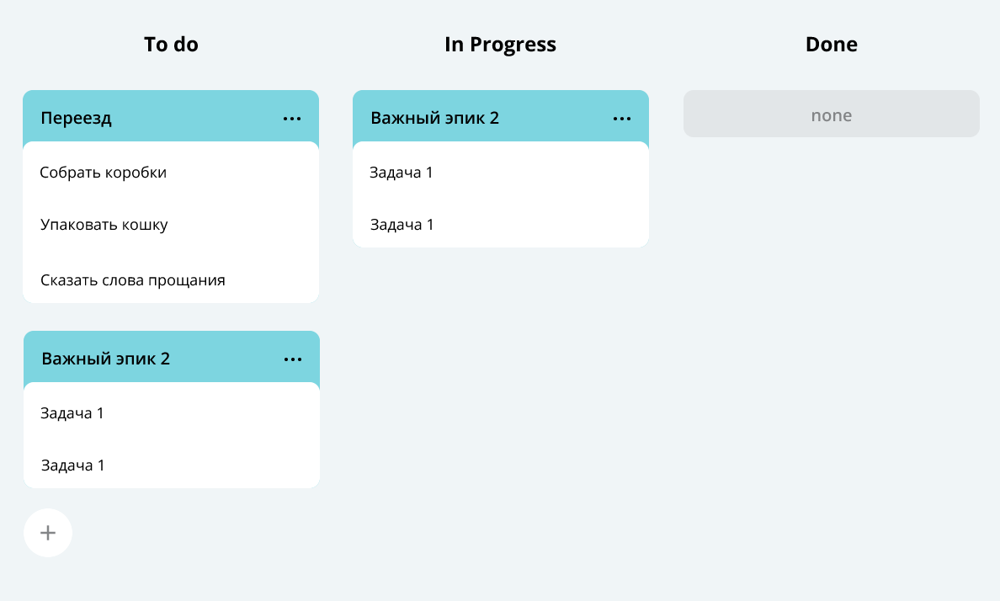

# Task tracker

## Описание
Сервис, позволяющий эффективно организовать совместную работу 
над задачами. Программа отвечает за формирование модели 
данных для следующей страницы:

#### Технологический стек
Java 11, JUnit

### Используются следующие API:
1. GET /tasks/task/?id= - возвращает таск, id которого будет указаоно в параметре
2. DELETE /tasks/task/?id= - удаляет таск, id которого было указано в параметре
3. GET /tasks/task/ - возвращает все таски
4. DELETE /tasks/task/ - удаляет все таски
5. POST /tasks/task/ - создание нового эпика или обновление данных о старом эпике. Параметры эпика передаются в теле запроса:
{ "status": "NEW", "Name": "task1", "Description": "task1Test", "taskId": 1, "duration": { "seconds": 0, "nanos": 0 }, "localDate": { "date": { "year": 999999999, "month": 12, "day": 31 }, "time": { "hour": 23, "minute": 59, "second": 59, "nano": 999999999 } }, "type": "TASK" }
6. GET /tasks/subtask/epic/?id= - возвращает сабтаски эпика, чье id указывается в параметре
7. GET /tasks/subtasks/?id= - возвращает сабтаск, id которого будет указаоно в параметре
8. DELETE /tasks/subtasks/?id= - удаляет сабтаск, id которого было указано в параметре
9. GET /tasks/subtasks/ - возвращает все сабтаски
10. DELETE /tasks/subtasks/ - удаляет все сабтаски
11. POST /tasks/subtasks/ - создание нового сабтаска или обновление данных о старом сабтаске. Параметры эпика передаются в теле запроса:
{ "status": "DONE", "Name": "subTask3Test", "Description": "subtask3Test", "taskId": 3, "duration": { "seconds": 10, "nanos": 0 }, "localDate": { "date": { "year": 2019, "month": 11, "day": 11 }, "time": { "hour": 1, "minute": 1, "second": 0, "nano": 0 } }, "type": "SUBTASK" }
12. GET /tasks/epic - вернет все эпики
13. POST /tasks/epic - создание нового эпика или обновление данных о старом эпике.Параметры эпика передаются в теле запроса:
{ "status": "NEW", "Name": "epic0", "Description": "epic0", "taskId": 0, "duration": { "seconds": 0, "nanos": 0 }, "localDate": { "date": { "year": 1, "month": 1, "day": 1 }, "time": { "hour": 1, "minute": 1, "second": 0, "nano": 0 } }, "type": "EPIC" } 
14. GET /tasks/history - возвращает историю 
15. GET /tasks - - возвращает все таски